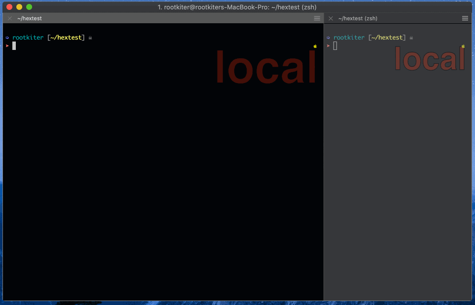

# How To Use



**Tips** : `f|` will help you locate the character area immediately.

# Install

## Install under blank environment

```
    $ git clone https://github.com/rootkiter/vim-hexedit.git ~/.vim
```

## Install under Pathogen

```
    $ git clone https://github.com/rootkiter/vim-hexedit.git ~/.vim/bundle/vim-hexedit
```
